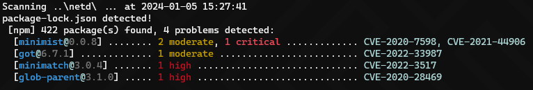
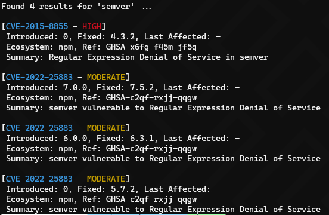

# :space_invader: CVEPack

CVEPack is a tool to detect vulnerabilities in packages. 

It uses [GitHub Advisory Database](https://github.com/github/advisory-database) as source for detecting CVEs.

Be aware, this is a proof of concept and a work in progress.

#### Ecosystems supported

- [x] NPM (Node.js)
- [x] Go
- [x] Packagist (PHP)
- [x] Crates.io (Rust)
- [x] RubyGems (Ruby)
- [x] PyPI (Python)
- [x] NuGet (.Net)
- [x] Maven (Java)

## Usage

#### Scan folder(s)

```bash
cvepack scan [-d|--details] <folder path> [<folder path> ...]
```



#### Search a package

```bash
cvepack search <package name>
```



#### Update CVE database

```bash
cvepack update
```